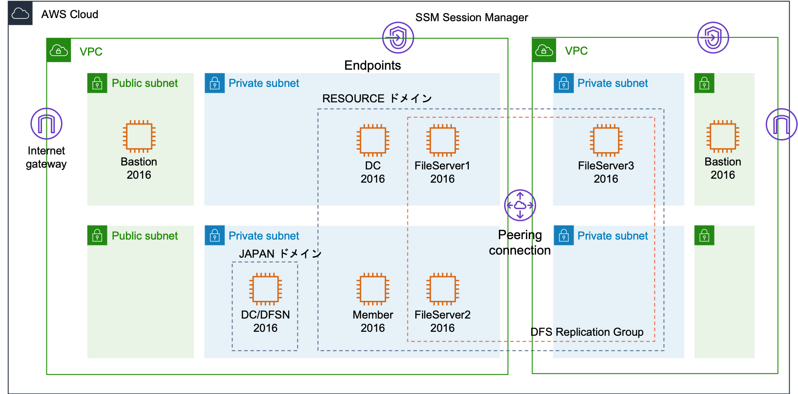
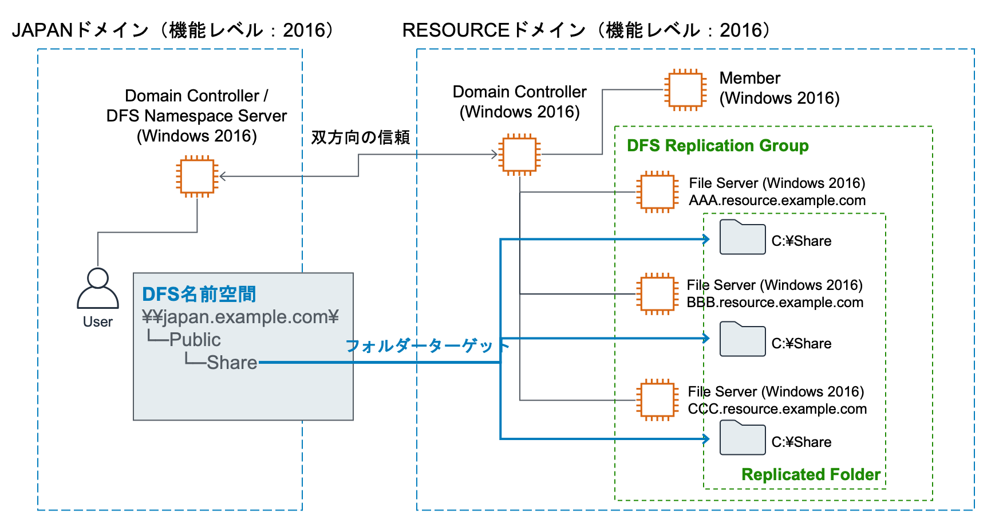

# DFSR-PoC-Environment

#### インフラ構成



#### Active Directory構成



## 前提

- デプロイは管理者権限を持つIAMユーザーの権限で行うため、IAMユーザーを用意して下さい。
- あらかじめ、環境をデプロイするリージョンにキーペアを用意して下さい。このキーペアをEC2インスタンスに設定します。
- 以下のソフウェアがインストール済みであることを確認して下さい。
    ```shell
    aws --version
    python3 --version
    node --version
    npm --version
    git --version
    jq --version
    ```
- 上記環境を整えるのが面倒な場合はCloud9の利用がお奨めです。以下の手順を参考にCloud9をセットアップしてください。
  - [Cloud9環境のセットアップ](https://github.com/sotoiwa/Analytics-PoC-Environment/blob/master/cloud9.md)

## CDKでのベースインフラストラクチャのデプロイ

### CDKのインストール

CDKをグローバルにインストールします。

```shell
npm install -g aws-cdk
```

### CDKプロジェクトのクローン

CDKプロジェクトをローカルにクローンします。

```shell
git clone https://github.com/sotoiwa/DFSR-PoC-Environment.git
cd DFSR-PoC-Environment
```

### Pythonの準備

Pythonのvirtualenvを作成して有効化します。

```shell
python3 -m venv .env
source .env/bin/activate
```

必要なpipモジュールをインストールします。

```shell
pip install -r requirements.txt
```

### 環境に合わせたカスタマイズ

`cdk.sample.json`を`cdk.json`としてコピーし、パラメータをいい感じに設定して下さい。

```shell
cp cdk.sample.json cdk.json
```

### デプロイ

CDKが使用するバケットを作成します。

```shell
cdk bootstrap
```

VPCと踏み台サーバーをデプロイします。

```shell
cdk deploy *Network*Stack *Bastion*Stack --require-approval never
```

## インターリージョンVPCピアリング

以下作業をマネジメントコンソールから実施します。

- VPCピアリングを作成します。
- 双方からのルートを定義します。
- 双方のセキュリティグループの通信を許可します。

## resource.example.comのセットアップ

ドメインコントローラー用のWindowsインスタンスと、このドメインの管理下に置くメンバー用のWindowsインスタンスと、ファイルサーバー用のWindowsインスタンスをデプロイします。

```shell
cdk deploy *ResourceDomain*Stack --require-approval never
```

### ドメインコントローラーの作成

`resource.example.com`のドメインを作成します。

踏み台インスタンス（BastionStack/Bastion）を経由してドメインコントローラーインスタンス（ResourceDomainStack/DomainController）にRDPし、PowerShellを起動します。
あるいは、セッションマネージャーでPowerShellを起動します。

ADドメインサービスの機能をインストールします。

```powershell
Import-Module ServerManager
Get-WindowsFeature
Install-WindowsFeature -Name AD-Domain-Services -IncludeManagementTools
Get-WindowsFeature
```

ドメインコントローラーに昇格させます。セーフモード用のパスワードを聞かれるので入力します。

（ドメインの機能レベル2016の場合）

```powershell
#
# AD DS 配置用の Windows PowerShell スクリプト
#

Import-Module ADDSDeployment
Install-ADDSForest `
-CreateDnsDelegation:$false `
-DatabasePath "C:\Windows\NTDS" `
-DomainMode "WinThreshold" `
-DomainName "resource.example.com" `
-DomainNetbiosName "RESOURCE" `
-ForestMode "WinThreshold" `
-InstallDns:$true `
-LogPath "C:\Windows\NTDS" `
-NoRebootOnCompletion:$false `
-SysvolPath "C:\Windows\SYSVOL" `
-Force:$true
```

自動的に再起動するのでしばらく待ちます。

### DNSサフィックス

ドメインコントローラーに踏み台サーバー経由でログインし、DNSの設定でサフィックスの設定で以下を追加します。

- resource.example.com
- japan.example.com

### メンバーとファイルサーバーのドメインへの参加

ドメインコントローラーのIPアドレスを確認します。

```shell
aws ec2 describe-instances | \
  jq -r '.Reservations[].Instances[] |
           select( .Tags ) | 
           select( [ select( .Tags[].Value | test("ResourceDomain") and test("DomainController") ) ] | length > 0 ) | 
           .PrivateIpAddress'
```

踏み台インスタンスを経由してメンバーインスタンスとファイルサーバーインスタンスにRDPし、PowerShellを起動します。
あるいは、セッションマネージャーでPowerShellを起動します。

DNSサーバーを変更します。

```powershell
Get-NetAdapter | Get-DnsClientServerAddress
Get-NetAdapter | Set-DnsClientServerAddress -ServerAddresses <ドメインコントローラのIPアドレス>
Get-NetAdapter | Get-DnsClientServerAddress
```

ADに参加します。ここで入力するパスワードはマネジメントコンソールでドメインコントローラーインスタンスの「接続」から確認します。

```powershell
$user = 'resource.example.com\Administrator'
$password = ConvertTo-SecureString -AsPlainText '<パスワード>' -Force
$Credential = New-Object System.Management.Automation.PsCredential($user, $password)
Add-Computer -DomainName resource.example.com -Credential $Credential
```

変更を反映するためリブートします。

```powershell
Restart-Computer -Force
```

### メンバーインスタンスへのログイン確認

踏み台インスタンスから、メンバーインスタンスに`Administrator@resource.example.com`でRDPできることを確認します。
このユーザーのパスワードはドメインコントローラーの`Administrator`ユーザーのパスワードなので、マネジメントコンソールで確認できます。

## japan.example.comのセットアップ

ドメインコントローラー用のWindowsインスタンスをデプロイします。

```shell
cdk deploy *JapanDomainStack --require-approval never
```

### ドメインコントローラーの作成

`japan.example.com`のドメインを作成します。

踏み台インスタンスを経由してドメインコントローラーインスタンス（JapanDomainStack/DomainController）にRDPし、PowerShellを起動します。
あるいは、セッションマネージャーでPowerShellを起動します。

ADドメインサービスの機能をインストールします。

```powershell
Import-Module ServerManager
Get-WindowsFeature
Install-WindowsFeature -Name AD-Domain-Services -IncludeManagementTools
Get-WindowsFeature
```

ドメインコントローラーに昇格させます。セーフモード用のパスワードを聞かれるので入力します。

（ドメインの機能レベル2016の場合）

```powershell
#
# AD DS 配置用の Windows PowerShell スクリプト
#

Import-Module ADDSDeployment
Install-ADDSForest `
-CreateDnsDelegation:$false `
-DatabasePath "C:\Windows\NTDS" `
-DomainMode "WinThreshold" `
-DomainName "japan.example.com" `
-DomainNetbiosName "JAPAN" `
-ForestMode "WinThreshold" `
-InstallDns:$true `
-LogPath "C:\Windows\NTDS" `
-NoRebootOnCompletion:$false `
-SysvolPath "C:\Windows\SYSVOL" `
-Force:$true
```

自動的に再起動するのでしばらく待ちます。

### DNSサフィックス

ドメインコントローラーに踏み台サーバー経由でログインし、DNSの設定でサフィックスの設定で以下を追加します。

- japan.example.com
- resource.example.com

### ユーザーの作成

踏み台インスタンスを経由してドメインコントローラーインスタンスにRDPし、PowerShellを起動します。
あるいは、セッションマネージャーでPowerShellを起動します。

ユーザーを作成します。

```powershell
Get-ADUser -Filter *
$user = 'user1'
$password = ConvertTo-SecureString -AsPlainText '<パスワード>' -Force
New-ADUser $user -AccountPassword $password -Enabled $true -PasswordNeverExpires $true
Get-ADUser -Filter *
```

Administratorsグループに追加します。

```powershell
Get-ADGroup -Filter *
Add-ADGroupMember -Identity Administrators -Members $user
Get-ADGroupMember -Identity Administrators
Get-ADGroup -Filter *
```

### ドメインコントローラーへのログイン確認

踏み台インスタンスから、ドメインコントローラーに`user1@japan.example.com`でRDPできることを確認します。

## 信頼関係の作成

RESOURCEドメインとJAPANドメインで双方向の信頼関係を結びます。

- [Tutorial: Create a Trust Relationship Between Your AWS Managed Microsoft AD and Your On-Premises Domain](https://docs.aws.amazon.com/directoryservice/latest/admin-guide/ms_ad_tutorial_setup_trust.html)
- [オンプレの AD DS と AWS の Microsoft AD 間で片方向信頼関係を結ぶ](https://www.vwnet.jp/Windows/Other/2017020601/AWS_MSAD_trust.htm)

### 条件付きフォワーダーの作成

#### RESOURCEドメイン

resource.example.comのドメインコントローラーで以下の作業を実施します。

```powershell
Get-DnsServerZone
Add-DnsServerConditionalForwarderZone `
    -Name "japan.example.com" `
    -MasterServers <JAPANのドメインコントローラーのアドレス> `
    -ReplicationScope "Forest"
Get-DnsServerZone
```

#### JAPANドメイン

japan.example.comのドメインコントローラーで以下の作業を実施します。

```powershell
Get-DnsServerZone
Add-DnsServerConditionalForwarderZone `
    -Name "resource.example.com" `
    -MasterServers <RESOURCEのドメインコントローラーのアドレス> `
    -ReplicationScope "Forest"
Get-DnsServerZone
```

### 信頼関係の作成

この作業をPowerShellでやるのは難しいのでここはGUIを使います。

#### RESOURCEドメイン

resource.example.comのドメインコントローラーで以下の作業を実施します。

1. サーバーマネージャーの右上のツールから「Active Directory ドメインと信頼関係」を開きます。
1. 左のペインでドメイン名を右クリックしてプロパティを開きます。
1. 信頼タブで「新しい信頼」を作成します。以下の選択肢がでない場合はしばらく待ってから作業を実施してください。

    |項目|値|備考|
    |---|---|---|
    |信頼の名前|japan.example.com||
    |信頼の種類|フォレストの信頼||
    |信頼の方向|双方向||
    |信頼を作成する対象|このドメインのみ||
    |出力方向の信頼認証レベル|フォレスト全体の認証||
    |信頼パスワード|（任意）||
    |出力方向の信頼を確認しますか?|確認しない||
    |入力方向の信頼を確認しますか?|確認しない||

作成した信頼はPowerShellで確認できます。

```powershell
Get-ADTrust -Filter *
```

#### JAPANドメイン

japan.example.comのドメインコントローラーで以下の作業を実施します。

1. サーバーマネージャーの右上のツールから「Active Directory ドメインと信頼関係」を開きます。
1. 左のペインでドメイン名を右クリックしてプロパティを開きます。
1. 信頼タブで「新しい信頼」を作成します。以下の選択肢がでない場合はしばらく待ってみて下さい。

    |項目|値|備考|
    |---|---|---|
    |信頼の名前|resource.example.com||
    |信頼の種類|フォレストの信頼||
    |信頼の方向|双方向||
    |信頼を作成する対象|このドメインのみ||
    |出力方向の信頼認証レベル|フォレスト全体の認証||
    |信頼パスワード|（任意）||
    |出力方向の信頼を確認しますか?|確認しない||
    |入力方向の信頼を確認しますか?|確認しない||

作成した信頼はPowerShellで確認できます。

```powershell
Get-ADTrust -Filter *
```

### メンバーインスタンスでのリモートデスクトップ接続の許可

AD環境であっても、メンバーインスタンスではAdministratorsグループやRemote Desktop Usersグループはローカルグループであり、マシンごとに異なるグループです。
メンバーインスタンスに`Administrator@resource.example.com`でRDPし、`user1@japan.example.com`のリモートデスクトップ接続を許可します。

1. スタートボタンを右クリックして「システム」を選択します。
1. 左のメニューで「リモートの設定」をクリックします。
1. 「リモート」タブで「ユーザーの選択」をクリックし、`user1@japan.example.com`を追加します。見つからないときはしばらく待ってみて下さい。

### メンバーインスタンスへのログイン確認

踏み台インスタンスから、メンバーインスタンスに`user1@japan.example.com`でRDPできることを確認します。

## 共有フォルダの作成

各ファイルサーバーで共有ディレクトリを作成します。

リモート実行する場合は以下のようにします。

```powershell
$FileServer1 = "EC2AMAZ-7TRSGU1"
$FileServer2 = "EC2AMAZ-3GTQGC8"
$FileServer3 = "EC2AMAZ-RRC6G8L"
Invoke-Command -ComputerName $FileServer1 -ScriptBlock { New-Item 'C:\Share1' -ItemType Directory }
Invoke-Command -ComputerName $FileServer1 -ScriptBlock { New-SmbShare -Name "Share1" -Path 'C:\Share1' -FullAccess "everyone" }
Invoke-Command -ComputerName $FileServer2 -ScriptBlock { New-Item 'C:\Share1' -ItemType Directory }
Invoke-Command -ComputerName $FileServer2 -ScriptBlock { New-SmbShare -Name "Share1" -Path 'C:\Share1' -FullAccess "everyone" }
Invoke-Command -ComputerName $FileServer2 -ScriptBlock { New-Item 'C:\Share1' -ItemType Directory }
Invoke-Command -ComputerName $FileServer3 -ScriptBlock { New-SmbShare -Name "Share1" -Path 'C:\Share1' -FullAccess "everyone" }
```

各ファイルサーバーにDFSレプリケーションの機能をインストールします。

```powershell
Invoke-Command -ComputerName $FileServer1 -ScriptBlock { Install-WindowsFeature FS-DFS-Replication }
Invoke-Command -ComputerName $FileServer2 -ScriptBlock { Install-WindowsFeature FS-DFS-Replication }
Invoke-Command -ComputerName $FileServer3 -ScriptBlock { Install-WindowsFeature FS-DFS-Replication }
```

## DFSの設定

JAPANドメインのドメインコントローラーをDFS名前空間サーバーとし、RESOURCEドメインにDFSレプリケーショングループを作成します。

### DFSレプリケーションの設定

RESOURCEドメインでレプリケーショングループを作ります。

ここでは、ドメインコントローラーではなく、FileServer1に管理ツールを入れて、FileServer1からDFSレプリケーションの構成を行います。
FileServer1に`Administrator@resource.example.com`でログインします。

DFS管理ツールをインストールします。

```powershell
Install-WindowsFeature RSAT-DFS-Mgmt-Con
```

#### GUI

サーバーマーネージャー > ツール > DFSの管理を開きます。

レプリケーションを右クリックして「新しいレプリケーショングループ」を作成します。


以下の流れでレプリケーショングループを作成します。


```
レプリケーション グループ名:
	Share1

レプリケーション グループの説明:
	

レプリケーション グループのドメイン:
	resource.example.com

レプリケーション グループ メンバー (3):
	EC2AMAZ-7TRSGU1
	EC2AMAZ-3GTQGC8
	EC2AMAZ-RRC6G8L

トポロジの種類:
	フル メッシュ

接続の一覧 (6):
	EC2AMAZ-3GTQGC8 -> EC2AMAZ-7TRSGU1
	EC2AMAZ-7TRSGU1 -> EC2AMAZ-3GTQGC8
	EC2AMAZ-RRC6G8L -> EC2AMAZ-7TRSGU1
	EC2AMAZ-7TRSGU1 -> EC2AMAZ-RRC6G8L
	EC2AMAZ-RRC6G8L -> EC2AMAZ-3GTQGC8
	EC2AMAZ-3GTQGC8 -> EC2AMAZ-RRC6G8L

既定の接続スケジュール:
	最大 帯域幅で継続してレプリケート 

プライマリ メンバー:
	EC2AMAZ-3GTQGC8

レプリケート フォルダーの名前:
	Share1

メンバー: EC2AMAZ-3GTQGC8
	パス: C:\Share1
	状態: 有効

メンバー: EC2AMAZ-7TRSGU1
	パス: C:\Share1
	状態: 有効

メンバー: EC2AMAZ-RRC6G8L
	パス: C:\Share1
	状態: 有効

NTFS アクセス許可: プライマリから


```


ファイルを作成してみて、レプリケートされることを確認します。

```powershell
Invoke-Command -ComputerName $FileServer1 -ScriptBlock { New-Item C:\Share1\Test1.txt -Value abc }
Invoke-Command -ComputerName $FileServer2 -ScriptBlock { dir C:\Share1 }
Invoke-Command -ComputerName $FileServer3 -ScriptBlock { dir C:\Share1 }

New-Item C:\Share1\Test1.txt -Value abc
```

```powershell
PS C:\Users\Administrator> Invoke-Command -ComputerName $FileServer1 -ScriptBlock { New-Item C:\Share1\Test1.txt -Val
ue abc }


    ディレクトリ: C:\Share1


Mode                LastWriteTime         Length Name                                PSComputerName
----                -------------         ------ ----                                --------------
-a----       2020/03/11     12:31              3 Test1.txt                           EC2AMAZ-7TRSGU1


PS C:\Users\Administrator> Invoke-Command -ComputerName $FileServer2 -ScriptBlock { dir C:\Share1 }


    ディレクトリ: C:\Share1


Mode                LastWriteTime         Length Name                                PSComputerName
----                -------------         ------ ----                                --------------
-a----       2020/03/11     12:31              3 Test1.txt                           EC2AMAZ-3GTQGC8


PS C:\Users\Administrator> Invoke-Command -ComputerName $FileServer3 -ScriptBlock { dir C:\Share1 }


    ディレクトリ: C:\Share1


Mode                LastWriteTime         Length Name                                PSComputerName
----                -------------         ------ ----                                --------------
-a----       2020/03/11     12:31              3 Test1.txt                           EC2AMAZ-RRC6G8L


PS C:\Users\Administrator>
```

#### CUIの場合

（動作確認できていないので参考）

- https://docs.microsoft.com/en-us/powershell/module/dfsr/new-dfsreplicationgroup

```powershell
$Group = "Share2"
New-DfsReplicationGroup -GroupName $Group
Get-DfsReplicationGroup
```

レプリケーションフォルダーを作ります。

```powershell
$Folder = "Share2"
New-DfsReplicatedFolder -GroupName $Group -FolderName $Folder
Get-DfsReplicatedFolder -GroupName $Group
```

メンバーを追加します。

```powershell
$FileServer1 = "EC2AMAZ-7TRSGU1"
$FileServer2 = "EC2AMAZ-3GTQGC8"
$FileServer3 = "EC2AMAZ-RRC6G8L"
Add-DfsrMember -GroupName $Group -ComputerName $FileServer1
Add-DfsrMember -GroupName $Group -ComputerName $FileServer2
Add-DfsrMember -GroupName $Group -ComputerName $FileServer3
Get-DfsrMember -GroupName $Group
```

メンバーシップを作成します。

```powershell
$ContentPath1 = "C:\Share2"
$ContentPath2 = "C:\Share2"
$ContentPath3 = "C:\Share3"
Set-DfsrMembership –GroupName $Group –FolderName $Folder –ContentPath $ContentPath1 –ComputerName $FileServer1 –PrimaryMember $True
Set-DfsrMembership –GroupName $Group –FolderName $Folder –ContentPath $ContentPath2 –ComputerName $FileServer2 –PrimaryMember $False
Set-DfsrMembership –GroupName $Group –FolderName $Folder –ContentPath $ContentPath3 –ComputerName $FileServer3 –PrimaryMember $False
Get-DfsrMembership -GroupName $Group
```

接続を作成します。

```powershell
Add-DfsrConnection –GroupName $Group –SourceComputerName $FileServer1 –DestinationComputerName $FileServer2
Add-DfsrConnection –GroupName $Group –SourceComputerName $FileServer2 –DestinationComputerName $FileServer3
Add-DfsrConnection –GroupName $Group –SourceComputerName $FileServer3 –DestinationComputerName $FileServer1
Get-DfsrConnection -GroupName $Group
```

### DFS名前空間の設定

JAPANのドメインコントローラーをDFS名前空間サーバーとして設定します。

- [PowerShellでDFSの環境を構築する](https://blog.shibata.tech/entry/2018/07/18/000420)

ドメインコントローラーにDFS名前空間の構成に必要な機能をインストールします。

```powershell
Install-WindowsFeature FS-DFS-Namespace, RSAT-DFS-Mgmt-Con
```

#### GUI

サーバーマーネージャー > ツール > DFSの管理を開きます。

名前空間を右クリックして「新しい名前空間」を作成します。


以下の流れで名前空間を作成します。


作成した名前空間を右クリックして「新しいフォルダー」を作成します。


追加をクリックし、フォルダーターゲットを追加し「OK」をクリックします。


レプリケーショングループを作成するが聞かれますが、ここでは作成しません。


#### CUI

（動作確認できていないので参考）

DFSルートを作ります。
名前空間サーバー上にある共有フォルダに対してNew-DfsnRootコマンドを実行します。

- https://docs.microsoft.com/en-us/powershell/module/dfsn/new-dfsnroot

```powershell
# 名前空間の作成
$DFSRootPath = '\\japan.example.com\Public'
$DFSRootTarget = 'C:\DFSRoots\Public'
$DFSRootSharedPath = "\\$(hostname)\Public"
# 共有フォルダを作成
mkdir $DFSRootTarget
New-SmbShare –Name 'Public' –Path $DFSRootTarget -FullAccess everyone
# DFSルート作成
New-DfsnRoot -Path $DFSRootPath -Type DomainV2 -TargetPath $DFSRootSharedPath
```

## 動作確認

JAPANドメインのuser1で、RESOURCEドメインのMember1コンピュータにログインし、そこから`\\japan.example.com\Public\Share1`がマウントできることを確認する。

```powershell
net use z: \\japan.example.com\Public\Share1
```

```powershell
PS C:\Users\user1> net use z: \\japan.example.com\Public\Share1
コマンドは正常に終了しました。

PS C:\Users\user1>
```

ファイルを作成する。

```powershell
New-Item Z:\Test2.txt -Value 123
```

ファイルが3つのファイルサーバーにレプリケートされることを確認する。
名前解決ができるRESOUCEドメインのサーバーから確認する。

```powershell
$FileServer1 = "EC2AMAZ-7TRSGU1"
$FileServer2 = "EC2AMAZ-3GTQGC8"
$FileServer3 = "EC2AMAZ-RRC6G8L"
Invoke-Command -ComputerName $FileServer1 -ScriptBlock { dir C:\Share1 }
Invoke-Command -ComputerName $FileServer2 -ScriptBlock { dir C:\Share1 }
Invoke-Command -ComputerName $FileServer3 -ScriptBlock { dir C:\Share1 }
```

```powershell
PS C:\Users\Administrator> $FileServer1 = "EC2AMAZ-7TRSGU1"
PS C:\Users\Administrator> $FileServer2 = "EC2AMAZ-3GTQGC8"
PS C:\Users\Administrator> $FileServer3 = "EC2AMAZ-RRC6G8L"
PS C:\Users\Administrator> Invoke-Command -ComputerName $FileServer1 -ScriptBlock { dir C:\Share1 }


    ディレクトリ: C:\Share1


Mode                LastWriteTime         Length Name                                PSComputerName
----                -------------         ------ ----                                --------------
-a----       2020/03/11     12:31              3 Test1.txt                           EC2AMAZ-7TRSGU1
-a----       2020/03/11     13:26              3 Test2.txt                           EC2AMAZ-7TRSGU1


PS C:\Users\Administrator> Invoke-Command -ComputerName $FileServer2 -ScriptBlock { dir C:\Share1 }


    ディレクトリ: C:\Share1


Mode                LastWriteTime         Length Name                                PSComputerName
----                -------------         ------ ----                                --------------
-a----       2020/03/11     12:31              3 Test1.txt                           EC2AMAZ-3GTQGC8
-a----       2020/03/11     13:26              3 Test2.txt                           EC2AMAZ-3GTQGC8


PS C:\Users\Administrator> Invoke-Command -ComputerName $FileServer3 -ScriptBlock { dir C:\Share1 }


    ディレクトリ: C:\Share1


Mode                LastWriteTime         Length Name                                PSComputerName
----                -------------         ------ ----                                --------------
-a----       2020/03/11     12:31              3 Test1.txt                           EC2AMAZ-RRC6G8L
-a----       2020/03/11     13:26              3 Test2.txt                           EC2AMAZ-RRC6G8L


PS C:\Users\Administrator>
```
